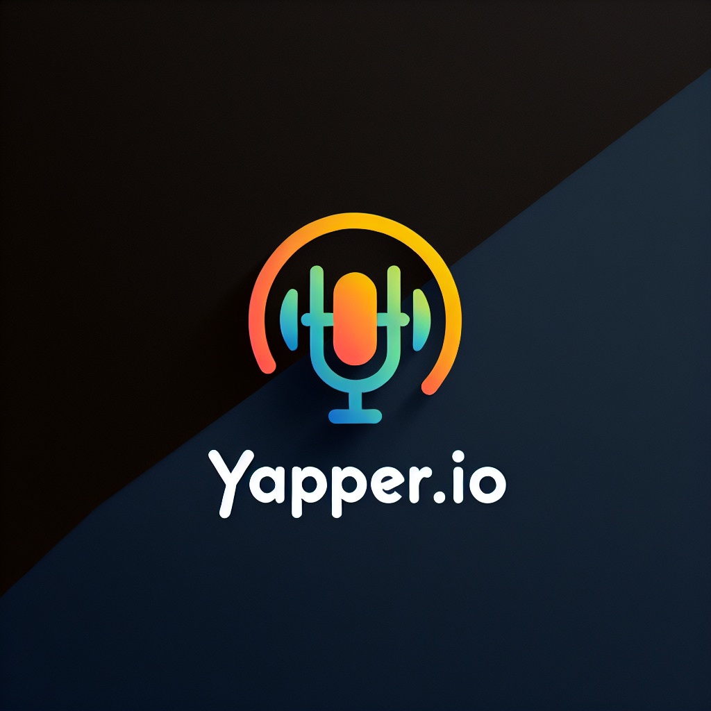

## Yapper
> Outline a brief description of your project.
> Live demo [_here_](https://www.example.com). <!-- If you have the project hosted somewhere, include the link here. -->

## Table of Contents
* [General Info](#general-information)
* [Technologies Used](#technologies-used)
* [Features](#features)
* [Screenshots](#screenshots)
* [Setup](#setup)
* [Usage](#usage)
* [Project Status](#project-status)
* [Room for Improvement](#room-for-improvement)
* [Acknowledgements](#acknowledgements)
* [Contact](#contact)
<!-- * [License](#license) -->

## General Information
- Provide general information about your project here.
- What problem does it (intend to) solve?
- What is the purpose of your project?
- Why did you undertake it?
<!-- You don't have to answer all the questions - just the ones relevant to your project. -->

---

# Project YAPPER

**Project YAPPER**, developed by **Ali Jalil, Joshua Egwaikhide, Abheek Pradhan, and Michael Elder**, is an innovative audio translation tool designed to bridge language barriers by translating spoken language audio recordings into text and subsequently into multiple languages. This solution addresses the challenges posed by language differences in our increasingly interconnected world, making cross-cultural communication more accessible, efficient, and accurate.

## Technical Architecture

### Client-Side (React Website)
- **User Interface:**  
  The front end of Project YAPPER is built using React, ensuring a dynamic, responsive, and user-friendly experience. Users can easily record or upload audio files, with real-time updates that keep them informed about the transcription process.
- **Real-Time Interaction:**  
  Utilizing React’s component-based architecture, the application offers immediate feedback and an engaging experience, which is especially beneficial for users needing quick and reliable translations.
- **Accessibility:**  
  The intuitive design makes the tool accessible to a wide range of users, including those who may not be tech-savvy, thereby broadening its impact.

### Server-Side (Cloud Services)
- **Cloud Integration:**  
  The backend leverages robust cloud services from providers like Amazon Web Services (AWS) or Microsoft Azure. This integration ensures high scalability, security, and performance—critical for processing and storing large volumes of audio data.
- **Speech-to-Text Processing:**  
  Advanced speech recognition algorithms hosted on the cloud convert spoken audio into text. These models are optimized to handle various accents and dialects, ensuring high accuracy in transcription.
- **Translation Capabilities:**  
  After converting speech to text, integrated translation APIs transform the transcription into the desired target language. This two-step process—speech-to-text followed by text translation—enables the application to effectively support multiple languages.
- **Scalability and Performance:**  
  Leveraging cloud services guarantees that Project YAPPER can dynamically scale to handle peak usage times without compromising performance, ensuring a reliable service for users worldwide.

## Purpose and Impact

The primary objective of Project YAPPER is to eliminate communication barriers by providing an efficient and accurate translation solution. By combining state-of-the-art speech recognition with robust cloud-based translation services, the project facilitates smoother cross-cultural interactions in both personal and professional contexts. This innovative approach supports the growing need for accessible language translation in our diverse global society.

## Why We Undertook This Project

Recognizing the challenges posed by language barriers in our increasingly interconnected world, our team—**Ali Jalil, Joshua Egwaikhide, Abheek Pradhan, and Michael Elder**—embarked on the development of Project YAPPER. Leveraging the latest advancements in cloud technology and machine learning, we aimed to create a tool that not only transcribes audio with high precision but also translates it in real time, thereby enhancing communication across different languages and cultures.

---

## Technologies Used
- Electron 34.0.2
- Python 3.10
- React 18.
- AWS or Azure

## Features for this audio transcription
#### 1. Upload a File  
- Description: Users can upload an audio file to be transcribed.  
- Users:** Students, researchers, and professionals needing transcription.  
- User Story: As a user, I want to upload an audio file so that I can generate a transcription.*  

#### 2. Play Audio File  
- Description: Users can play the uploaded audio file directly within the application.  
- Users: Anyone reviewing the transcription alongside the audio.  
- User Story: As a user, I want to play the audio file so that I can verify the transcription.*  

#### 3. View Transcription Text  
- Description: The transcribed text is displayed in a readable format.  
- Users: Users who need written notes from audio.  
- User Story: As a user, I want to see the transcribed text so that I can read and edit it.*  

### Future Features  

#### 1. Split Audio into Sections  
- Description: The audio will be divided into sections, making it easier to organize notes.  

#### 2. Share Notes  
- Description: Users will be able to share their transcribed notes with others.  

#### 3. Group Notes  
- Description: Users can categorize and group their notes for better organization.  

## Screenshots

<!-- If you have screenshots you'd like to share, include them here. -->

<!-- Optional -->
<!-- ## License -->
<!-- This project is open source and available under the [... License](). -->
This program is free software: you can redistribute it and/or modify
it under the terms of the GNU General Public License as published by
the Free Software Foundation, either version 3 of the License, or
(at your option) any later version.

This program is distributed in the hope that it will be useful,
but WITHOUT ANY WARRANTY; without even the implied warranty of
MERCHANTABILITY or FITNESS FOR A PARTICULAR PURPOSE.  See the
GNU General Public License for more details.

You should have received a copy of the GNU General Public License
along with this program.  If not, see <https://www.gnu.org/licenses/>.

<!-- You don't have to include all sections - just the one's relevant to your project -->