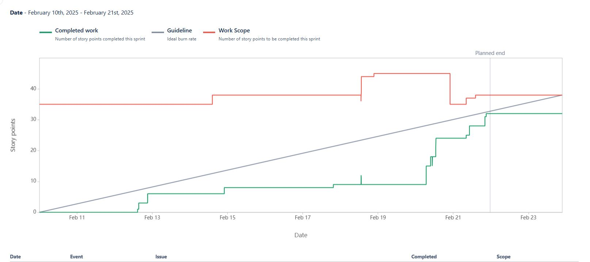
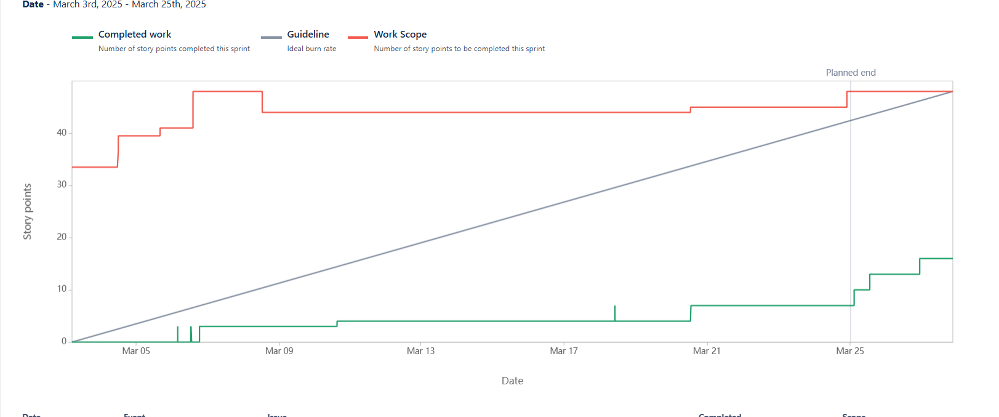

## Yapper
> Outline a brief description of your project.
> Live demo [_here_](https://www.example.com). <!-- If you have the project hosted somewhere, include the link here. -->

## Table of Contents
* [General Info](#general-information)
* [Technologies Used](#technologies-used)
* [Features](#features)
* [Screenshots](#screenshots)
* [Setup](#setup)
* [Usage](#usage)
* [Project Status](#project-status)
* [Room for Improvement](#room-for-improvement)
* [Acknowledgements](#acknowledgements)
* [Contact](#contact)
<!-- * [License](#license) -->

---

# Project YAPPER

**Project YAPPER**, developed by **Ali Jalil, Joshua Egwaikhide, Abheek Pradhan, and Michael Elder**, is an innovative audio translation tool designed to bridge language barriers by translating spoken language audio recordings into text and subsequently into multiple languages. This solution addresses the challenges posed by language differences in our increasingly interconnected world, making cross-cultural communication more accessible, efficient, and accurate.

## Technical Architecture

### Client-Side (React Website)
- **User Interface:**  
  The front end of Project YAPPER is built using React, ensuring a dynamic, responsive, and user-friendly experience. Users can easily record or upload audio files, with real-time updates that keep them informed about the transcription process.
- **Real-Time Interaction:**  
  Utilizing React’s component-based architecture, the application offers immediate feedback and an engaging experience, which is especially beneficial for users needing quick and reliable translations.
- **Accessibility:**  
  The intuitive design makes the tool accessible to a wide range of users, including those who may not be tech-savvy, thereby broadening its impact.

### Server-Side (Cloud Services)
- **Cloud Integration:**  
  The backend leverages robust cloud services from providers like Amazon Web Services (AWS) or Microsoft Azure. This integration ensures high scalability, security, and performance—critical for processing and storing large volumes of audio data.
- **Speech-to-Text Processing:**  
  Advanced speech recognition algorithms hosted on the cloud convert spoken audio into text. These models are optimized to handle various accents and dialects, ensuring high accuracy in transcription.
- **Translation Capabilities:**  
  After converting speech to text, integrated translation APIs transform the transcription into the desired target language. This two-step process—speech-to-text followed by text translation—enables the application to effectively support multiple languages.
- **Scalability and Performance:**  
  Leveraging cloud services guarantees that Project YAPPER can dynamically scale to handle peak usage times without compromising performance, ensuring a reliable service for users worldwide.

## Purpose and Impact

The primary objective of Project YAPPER is to eliminate communication barriers by providing an efficient and accurate translation solution. By combining state-of-the-art speech recognition with robust cloud-based translation services, the project facilitates smoother cross-cultural interactions in both personal and professional contexts. This innovative approach supports the growing need for accessible language translation in our diverse global society.

## Why We Undertook This Project

Recognizing the challenges posed by language barriers in our increasingly interconnected world, our team—**Ali Jalil, Joshua Egwaikhide, Abheek Pradhan, and Michael Elder**—embarked on the development of Project YAPPER. Leveraging the latest advancements in cloud technology and machine learning, we aimed to create a tool that not only transcribes audio with high precision but also translates it in real time, thereby enhancing communication across different languages and cultures.

---
## Technologies Used
- Electron 34.0.2
- Python 3.10
- React 18.
- AWS or Azure

## Features for this audio transcription
### Sprint 1
#### Contributions
**Ali**: "Made a simple UI design for the Home page and Trash page, as well as doing implementing the delete function" 

  - `Jira Task: Ali - Implement displaying list of transcriptions docs` 
    - [Scrum-16](https://cs3398-gorns-spring.atlassian.net/browse/SCRUM-16), 
    [Bitbucket](https://bitbucket.org/cs3398-gorns-s25/yapper/src/UI-Design/) 
  - `Jira Task: Ali - Design and Implement Delete Button Functionality` 
    - [Scrum-26](https://cs3398-gorns-spring.atlassian.net/browse/SCRUM-26), 
    [Bitbucket](https://bitbucket.org/cs3398-gorns-s25/yapper/src/UI--Backend-Delete/) 
  - `Jira Task: Ali - Confirmation Window for delete button` 
    - [Scrum-28](https://cs3398-gorns-spring.atlassian.net/browse/SCRUM-28), 
    [Bitbucket](https://bitbucket.org/cs3398-gorns-s25/%7Bc8e89328-5511-486d-af12-f338b21ce8d9%7D/branch/SCRUM-28-confirmation-window) 
  - `Jira Task: Ali - Implement Trash Bucket page/backend for deleted doc` 
    - [Scrum-14](https://cs3398-gorns-spring.atlassian.net/browse/SCRUM-14), 
    [Bitbucket](https://bitbucket.org/cs3398-gorns-s25/%7Bc8e89328-5511-486d-af12-f338b21ce8d9%7D/branch/feature/SCRUM-14-implement-trash-bucket-page-bac) 
  - `Jira Task: Ali - Implement Undo Delete doc` 
    - [Scrum-30](https://cs3398-gorns-spring.atlassian.net/browse/SCRUM-30),
    [Bitbucket](https://bitbucket.org/cs3398-gorns-s25/%7Bc8e89328-5511-486d-af12-f338b21ce8d9%7D/branch/SCRUM-30-implement-undo-delete) 
  - `Jira Task: Ali - Brent - Error Handling for Deletions` 
    - [Scrum-17](https://cs3398-gorns-spring.atlassian.net/browse/SCRUM-17), 
    [Bitbucket](https://bitbucket.org/cs3398-gorns-s25/%7Bc8e89328-5511-486d-af12-f338b21ce8d9%7D/branch/bugfix/SCRUM-17-error-handling-for-deletions)

**Michael**: "Made a simple UI design for the Home page and Trash page, as well as doing implementing the delete function" 

  - `Jira Task: Michael - View Transcription Text` 
  - [Scrum-25](https://cs3398-gorns-spring.atlassian.net/browse/SCRUM-25), 
  [Bitbucket](https://bitbucket.org/cs3398-gorns-s25/%7Bc8e89328-5511-486d-af12-f338b21ce8d9%7D/branch/feature/SCRUM-25-process-audio-file-for-transcription)
  
    
**Abheek:**  
*"I worked on implementing display and editing for transcriptions in the front end, implementing real-time transcription, and processing audio for transcription, as well as front end and backend integration."*  

- Jira Task: Abheek - Implement display and editing for transcriptions  
  *Scrum-23, Bitbucket*  
  [SCRUM-23-frontend-display-and-editing-for/](https://bitbucket.org/cs3398-gorns-s25/yapper/src/SCRUM-23-frontend-display-and-editing-for/)  

- Jira Task: Abheek - Implement real-time transcription  
  *Scrum-29, Bitbucket*  
  [SCRUM-29-implement-real-time-transcripti/](https://bitbucket.org/cs3398-gorns-s25/yapper/src/SCRUM-29-implement-real-time-transcripti/)  

- Jira Task: Abheek - Process audio file for transcription  
  *Scrum-25, Bitbucket*  
  [feature/SCRUM-25-process-audio-file-for-transcription](https://bitbucket.org/cs3398-gorns-s25/yapper/src/fbdb6e91bae85a8ec6bc3f34b6598bab4a8f8289/?at=feature%2FSCRUM-25-process-audio-file-for-transcription)  
  
 *Got it! Here’s your formatted text in the same style as Ali’s:  

 **Joshua** - Implemented the Firebase/ Firestore upload logic and almost finished user signup 
- `Jira Task: Joshua - Implement secure file storage`  
  - [Scrum-39](https://cs3398-gorns-spring.atlassian.net/browse/SCRUM-39),  
    [Bitbucket](https://bitbucket.org/cs3398-gorns-s25/yapper/src/85c8d62e16e7e4798a729e4cb32154f5dc542bbd/?at=feature%2FSCRUM-39-implement-secure-file-storage)  

- `Jira Task: Joshua - Implement user signup`  
  - [Scrum-55](https://cs3398-gorns-spring.atlassian.net/browse/SCRUM-55),  
    [Bitbucket](https://bitbucket.org/cs3398-gorns-s25/yapper/src/SCRUM-55-implement-user-login/)  

 
 

#### Reports

    
#### Next Steps
**Ali**:  
- Develop a way for the audio to be played in the view/editing in the text editor  
- Develop a way for the audio to be formatted in a note-like way  
- Make the UI look better for the text editor.

**Michael**:  
- continue debugging the confidence score feature (SCRUM-35)  
- have transcription text highlight words or sections with a 25% or less confidence score  
- add functionality to montior the process of the current transcription (SCRUM-2)  

**Abheek:**
- **Enhance Signal Quality and Integrity (Real-Time Filtering):**  
  1. Research and select advanced digital signal processing (DSP) techniques (e.g., band-pass filters, noise reduction algorithms).  
  2. Integrate these DSP modules to perform near real-time filtering of incoming audio streams.  
  3. Continuously evaluate and optimize the signal-to-noise ratio (SNR) to ensure clean, high-fidelity audio for further processing.

- **Voice Modulation, Isolation, and Identification:**  
  1. Implement pre-processing methods (e.g., voice activity detection, channel separation) to isolate individual voices or sound sources.  
  2. Use metadata tagging for different speakers prior to feeding audio into the machine learning model.  
  3. Perform post-processing steps to refine speaker identification results, ensuring higher accuracy in voice-specific translations.

- **Cross-Platform Input Integration (Phone/Watch/Online Media):**  
  1. Enable microphone streaming from various devices (mobile phones, smartwatches) to the central database.  
  2. Integrate and parse audio from other sources (e.g., phone calls, YouTube videos) for storage and further transcription.  
  3. Implement secure data transfer protocols to maintain data integrity and confidentiality.

- **GPU Acceleration and Model Enhancement (MoE):**  
  1. Migrate existing speech-to-text and translation models to GPU-optimized frameworks (e.g., PyTorch, TensorFlow with CUDA).  
  2. Explore a Mixture of Experts (MoE) model to efficiently handle multi-functionalities like speech-to-text, modulation, translation, and speaker isolation.  
  3. Conduct thorough performance benchmarks, fine-tuning hyperparameters to ensure minimal latency and maximal accuracy.

**Joshua**:
- Definitely continue implementing the DB and the storage  
- Work on integrating customer log in to the DB  

### Sprint 2
#### Contributions

**Ali**: "Added A audio player for when you view notes, as well as updated the UI to look better on the eyes" 

  - `Jira Task: Ali - Design and Implement the Audio Player` 
    - [Scrum-44](https://cs3398-gorns-spring.atlassian.net/browse/SCRUM-44), 
    [Bitbucket](https://bitbucket.org/cs3398-gorns-s25/%7Bc8e89328-5511-486d-af12-f338b21ce8d9%7D/branch/SCRUM-44-design-and-implement-the-audio-) 
  - `Jira Task: Ali - Research` 
    - [Scrum-47](https://cs3398-gorns-spring.atlassian.net/browse/SCRUM-47), 
    [Bitbucket](https://bitbucket.org/cs3398-gorns-s25/%7Bc8e89328-5511-486d-af12-f338b21ce8d9%7D/branch/SCRUM-47-research) 
  - `Jira Task: Ali - Develop Backend for Formatting Transcriptions` 
    - [Scrum-48](https://cs3398-gorns-spring.atlassian.net/browse/SCRUM-48), 
    [Bitbucket](https://bitbucket.org/cs3398-gorns-s25/%7Bc8e89328-5511-486d-af12-f338b21ce8d9%7D/branch/SCRUM-48-develop-backend-api-for-formatt) 
  - `Jira Task: Ali - Design and Implement Frontend UI for Viewing Formatted Notes` 
    - [Scrum-50](https://cs3398-gorns-spring.atlassian.net/browse/SCRUM-50), 
    [Bitbucket](https://bitbucket.org/cs3398-gorns-s25/%7Bc8e89328-5511-486d-af12-f338b21ce8d9%7D/branch/SCRUM-50-design-and-implement-frontend-u) 

 

#### Reports

#### Next Steps
**Ali**:  
- Have the a formatted note style show.
- Make the UI better looking. 
- Have a way to generate a shareable link.

**Michael**
- help Ali with UI
- was unable to complete (SCRUM-31,35, and 36) due to a possible 
Mac OS dependency binary incompatability. 2 libraries and Torch or Flask, depend on two different of eventlet that are incomptability with each other. One of them requires 3.9 with eventlet 0.33.0 and another requires 3.10 with eventlet 0.35.0

 
## Screenshots

<!-- If you have screenshots you'd like to share, include them here. -->

<!-- Optional -->
<!-- ## License -->
<!-- This project is open source and available under the [... License](). -->
This program is free software: you can redistribute it and/or modify
it under the terms of the GNU General Public License as published by
the Free Software Foundation, either version 3 of the License, or
(at your option) any later version.

This program is distributed in the hope that it will be useful,
but WITHOUT ANY WARRANTY; without even the implied warranty of
MERCHANTABILITY or FITNESS FOR A PARTICULAR PURPOSE.  See the
GNU General Public License for more details.

You should have received a copy of the GNU General Public License
along with this program.  If not, see <https://www.gnu.org/licenses/>.

<!-- You don't have to include all sections - just the one's relevant to your project -->